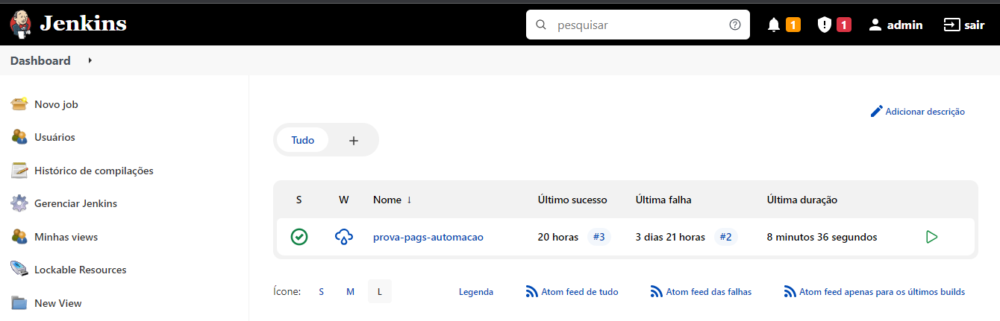
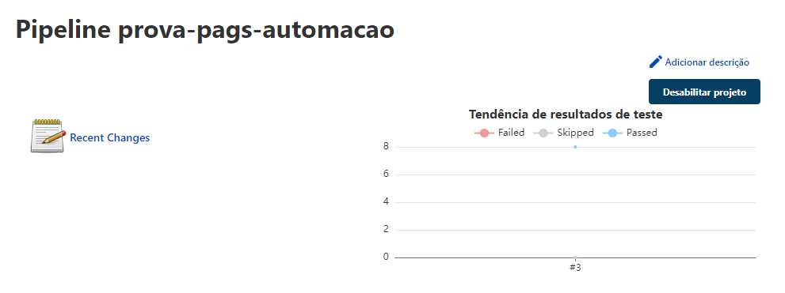
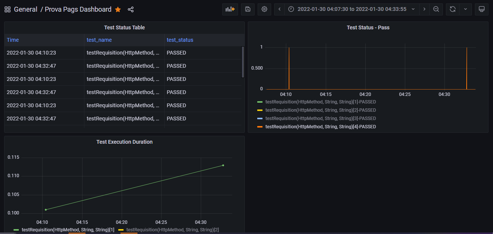

# Pags: Projeto de avaliação para Engenheiro de Qualidade

## Resumo
Este é um projeto que engloba as implementações necessárias que são requisitos para a posição de engenheiro de qualidade na Pagseguro.

A estrutura do projeto é composta pelos seguintes itens:
* docker-compose e os volumes dos conteineres;
* uma API escrita em Python (pags_api_status_code);
* um projeto de testes escrito em Java (pags_api_tests);
* jenkinsfile.

### Docker-Compose
No arquivo docker-compose estão descritos três contêineres, sendo eles:
* <b>jenkins</b>: contêiner onde é construída a aplicação necessária para rodar a pipeline que executa tanto a API em Python como o projeto de testes;
* <b>influxdb</b>: contêiner que sobe um banco de dados de séries temporais, do inglês <i>Time series database</i> (TSDB). Segundo o <a href="https://www.influxdata.com/time-series-database/">InfluxData</a>, o TSDB é um banco de dados otimizado para dados de série temporal ou com registro de data e hora. No InfluxDB serão armazenados os dados dos testes executados em cima da API.
* <b>grafana</b>: contêiner de uma aplicação web que disponibiliza visualização de dados interativa, provendo tabelas, gráficos e alertas quando conectado a fontes de dados compatíveis. Aqui teremos um dashboard do status dos testes executados e armazenados no InfluxDb.

### Jenkinsfile
O arquivo Jenkinsfile é composto por cinco estágios, sendo eles:
* obtenção do repositório a partir do Github;
* criação de uma ponte para realizar a comunicação de rede entre o contêiner da API e do projeto onde são rodados os testes;
* construção e execução da API de Status Code;
* construção e execução dos testes em cima da API de Status Code;
* remoção da ponte e dos contêineres criados anteriormente.

### API de Status Code
No diretório pags_api_status_code, é construída uma API REST, escrita em linguagem de programação Python 3.8, e usando o framework FastAPI. Aqui são disponibilizados quatro endpoints baseados na sessão Status codes do site https://httpbin.org, sendo eles GET, POST, PUT e DELETE. Para todos eles, é passada um parâmetro de caminho com o código HTTP de resposta que deseja-se obter. Por exemplo: ao fazer um POST para o endereço https://httpbin.org/status/200, é retornada uma resposta de sucesso. A mesma coisa foi replicada nessa API. 

Caso queira-se executar a API fora do contexto do Jenkinsfile, basta mudar para o diretório dela e executar os seguintes comando:

```
docker build -t my_app .
docker run -d --name app -p 8081:8081 my_app
```

Pode-se verificar a documentação da API digitando o seguinte endereço no seu navegador de preferência:

```
http://localhost:8081/redoc
```

Ela também conta com um Swagger, que pode ser visto em:
```
http://localhost:8081/docs
```
### Projeto de testes
O projeto de testes foi construído em Maven como gerenciador de dependências e <i>build system</i>, em linguagem de programação JAVA, com JDK 11. Para a escrita dos testes, foi utilizado o JUnit5, e para realizar as requisições foi usado o framework Spring Web.

Não é necessário subir o contêiner da API para realizar os testes. Por padrão, a URL utilizada para testar as requisições é a do https://httpbin.org, como pode ser visto em seu Dockerfile. Portanto, caso queira executar o projeto de testes separadamente, isso também é possível. Vá ao diretório pags_api_tests, e execute os seguintes comandos:

```
docker build -t my_tests .
docker run -d --name tests my_tests
```

São executados oito testes, ou seja, dois testes para cada endpoint (GET, POST, PUT, DELETE), sendo um de sucesso e um de falha. Através do arquivo data_provider.json (pags_api_tests/src/resources/support), são especificados os códigos HTTP de sucesso e falha que devem ser testados.

### Fluxo dentro da pipeline
Não será necessário muito esforço para execução da pipeline. Basta no diretório raiz do projeto executar o docker-compose da seguinte maneira:

```
docker-compose up -d
```

Após isso, deve-se ir para a página web com a interface para o Jenkins, no seguinte endereço:

```
http://localhost:8080
```

As credenciais de acesso são admin e admin para usuário e senha, respectivamente. Ao logar, a visão será a seguinte:



A seguir, basta clicar no <i>job</i> prova-pags-automacao e clicar na opção do menu lateral esquerdo "Construir agora". Assim, o pipeline será executado. Ainda nessa página, é possível ver um gráfico de tendência de resultados de teste por execução:



Que pode ser interpretado da seguinte maneira: oito testes na última construção de pipeline passaram.

Ao final do estágio de execução dos testes, o plugin do JUnit instalado no jenkins será o responsável pela geração do gráfico de tendência de resultados de teste apresentado anteriormente. Além disso, o relatório de testes gerado pelo Surefire será utilizado para inserção de dados no InfluxDB.

Por fim, podem ser vistas algumas métricas pelo Grafana, a partir do seguinte endereço:

```
http://localhost:3000
```

Para se autenticar ao Grafana basta usar admin e admin como usuário e senha, respectivamente. Após a fase de autenticação, é apresentado o dashboard como pode ser visto na figura abaixo:



Aqui são apresentados três paineis:
* uma tabela listando os campos de tempo, nome e status do teste, se passou ou falhou;
* um gráfico com o status do teste agregado pelo nome do teste;
* um gráfico com a duração da execução dos testes, também agregado pelo nome do teste.

A cada nova construção de pipeline, esses paineis são atualizados com os novos dados inseridos no InfluxDb e consumidos pelo Grafana.

## Requisitos de execução do projeto
* git
* docker

## Melhorias futuras
A estrutura desse projeto faz com que os contêineres de API e de testes sejam executados em um conceito chamado de Docker in Docker. O que isso quer dizer? Basicamente o contêiner do Jenkins já está sendo executado em cima de um Docker Host, e mais dois outros contêineres dentro dele também serão executados. Isso foi implementado dessa maneira pela facilidade de agregação de toda a estrutura necessária para que a pipeline seja executada, entretanto é desaconselhável pela comunidade. Para construção do contêiner do Jenkins, foi necessário personalizar seu Dockerfile, inserindo em um dos passos o download e a instalação do Docker.

Outra melhoria futura é trazer para dentro do Dockerfile do Jenkins os plugins necessários para execução do contêiner sem ser necessário usar o volume do diretório jenkins-data, que torna o tamanho do projeto maior que 300MB.

Caso algum teste falhe, a pipeline será encerrada sem fazer o processamento dos dados para mostrar no Grafana. Portanto, esse também é um ponto de melhoria futura.

Enjoy! 🎉